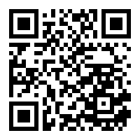

# Задачи для HighLoad++ 2019 от BI.ZONE

## [Go](golang/)

## [Scala](scala/)

## [Математика](math/)

## [Web-уязвимости](web_sec/)

## Ссылка на репозиторий

https://github.com/bi-zone/highload-2019

https://bit.ly/BZ_HL2019

